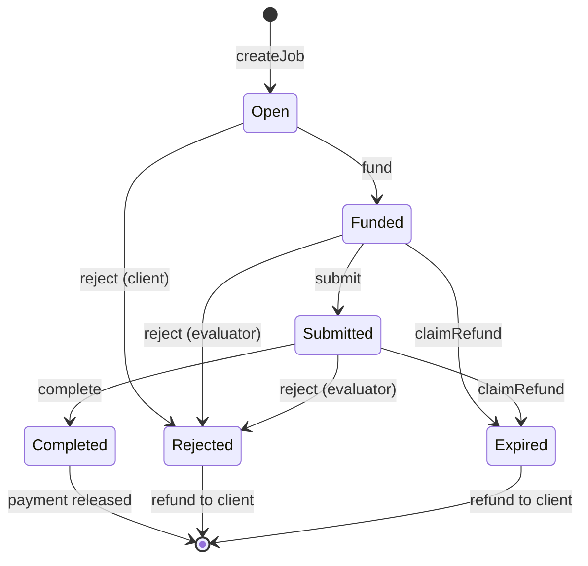

# Market Contract — ERC-8183 Agentic Commerce

A minimal, spec-compliant implementation of [ERC-8183: Agentic Commerce](https://eips.ethereum.org/EIPS/eip-8183) — job escrow with evaluator attestation for agent commerce.

## Overview

ERC-8183 defines a protocol where a **client** locks funds, a **provider** submits work, and an **evaluator** attests completion or rejection. The contract manages the full job lifecycle:



### Key Features

- **Single ERC-20 escrow** — one payment token per contract deployment
- **Evaluator attestation** — only the evaluator can complete or reject submitted work
- **Front-running protection** — `fund()` requires `expectedBudget` to match
- **Optional hooks** — extensible via `IACPHook` (beforeAction / afterAction)
- **Safe by default** — ReentrancyGuard, SafeERC20, Ownable2Step
- **`claimRefund` not hookable** — funds always recoverable after expiry

## Prerequisites

- [Foundry](https://book.getfoundry.sh/getting-started/installation) (forge, cast, anvil)
- Solidity 0.8.28+

## Build

```bash
forge build
```

## Test

```bash
forge test -vvv
```

## Deploy

```bash
export PAYMENT_TOKEN=0x...    # ERC-20 token address
export TREASURY=0x...         # Platform fee recipient
export PLATFORM_FEE_BP=250    # 2.5% fee
# OWNER defaults to deployer if not set

forge script script/DeployAgenticCommerce.s.sol:DeployAgenticCommerce \
  --rpc-url $RPC_URL --broadcast --verify
```

## Spec Compliance

This implementation covers all **MUST/SHALL** requirements of ERC-8183:

- 6 states, 8 valid transitions, no others
- All 8 core functions with correct role checks
- All 8 events emitted on corresponding state transitions
- Hook gas limits, non-hookable `claimRefund`
- SafeERC20, ReentrancyGuard

Optional extensions (ERC-2771 meta-transactions, ERC-8004 reputation) are not included but can be integrated via hooks.

## Design Philosophy

This implementation follows a **minimal on-chain, flexible off-chain** architecture:

| On-Chain (This Contract) | Off-Chain (Your Services) |
| --- | --- |
| ✅ Trustless fund escrow | Task discovery & matching |
| ✅ State machine (6 states) | Notifications & messaging |
| ✅ Role-based access control | Reputation & ratings |
| ✅ Automatic fee distribution | Dispute resolution UI |
| ✅ Timeout protection | Bidding & negotiation |
| ✅ Hook extension points | Content storage (IPFS/S3) |

The contract handles **trust-minimized fund custody** — the one thing that *must* be on-chain. Everything else (search, chat, ratings, complex workflows) is better served by off-chain systems that are cheaper, faster, and easier to iterate.

This is why we don't include multi-mode auctions, on-chain messaging, or reputation scoring like some other implementations. Those features add gas costs and complexity while providing no additional trust guarantees.

## License

This project is licensed under the MIT License - see the [LICENSE](LICENSE) file for details.
