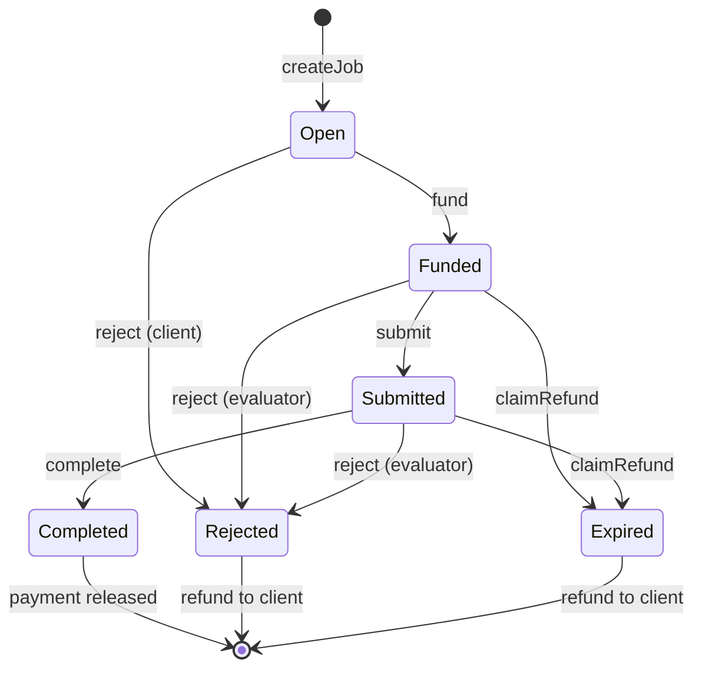

# Market Contract — ERC-8183 Agentic Commerce

A production-ready, gas-optimized implementation of [ERC-8183: Agentic Commerce](https://eips.ethereum.org/EIPS/eip-8183) — job escrow with evaluator attestation for autonomous agent commerce.

## Overview

ERC-8183 defines a protocol where a **client** locks funds, a **provider** submits work, and an **evaluator** attests completion or rejection. This contract manages the full job lifecycle with strict state machine enforcement:


```mermaid
stateDiagram-v2
    [*] --> Open: createJob
    Open --> Funded: fund
    Open --> Rejected: reject (client)
    Funded --> Submitted: submit
    Funded --> Rejected: reject (evaluator)
    Funded --> Expired: claimRefund
    Submitted --> Completed: complete
    Submitted --> Rejected: reject (evaluator)
    Submitted --> Expired: claimRefund
    Completed --> [*]: payment released
    Rejected --> [*]: refund to client
    Expired --> [*]: refund to client
```

## Features

### Core

- **ERC-8183 compliant** — strict adherence to the specification interface
- **Single ERC-20 escrow** — immutable payment token per deployment
- **Evaluator attestation** — only the evaluator can complete or reject submitted work
- **Front-running protection** — `fund()` requires `expectedBudget` to match current budget

### Gas Optimization

- **Storage packing** — `JobStorage` struct optimized to 7 slots (vs typical 10+)
- **ReentrancyGuardTransient** — EIP-1153 transient storage for cheaper reentrancy protection
- **Immutable variables** — `PAYMENT_TOKEN`, `HOOK_GAS_LIMIT` stored in bytecode

### Security

- **Ownable2Step** — two-step ownership transfer prevents accidental transfers
- **SafeERC20** — safe token transfers with return value checks
- **Fee snapshot** — fees captured at `fund()` time, immune to admin changes
- **Hook gas limit** — 500k gas cap prevents griefing attacks
- **Non-hookable `claimRefund`** — funds always recoverable after expiry

### Extensibility

- **Optional hooks** — `IACPHook` interface for `beforeAction` / `afterAction` callbacks
- **Hook whitelist** — admin-controlled allowlist with ERC-165 validation
- **BaseACPHook** — abstract router for building custom hooks

## Prerequisites

- [Foundry](https://book.getfoundry.sh/getting-started/installation) (forge ≥ 0.3.0)
- Solidity 0.8.28+
- EVM target: Osaka (EIP-1153 support required)

## Build

```bash
forge build
```

## Test

```bash
forge test -vvv
```

All 92 tests passing with comprehensive coverage of state transitions, role checks, fee calculations, hook interactions, and edge cases.

## Deploy

```bash
export PAYMENT_TOKEN=0x...      # ERC-20 token address
export TREASURY=0x...           # Platform fee recipient
export PLATFORM_FEE_BP=250      # 2.5% platform fee (max 5000)
export EVALUATOR_FEE_BP=100     # 1% evaluator fee (max 5000)
# OWNER defaults to deployer if not set

forge script script/DeployAgenticCommerce.s.sol:DeployAgenticCommerce \
  --rpc-url $RPC_URL --broadcast --verify
```

## Spec Compliance

This implementation covers all **MUST/SHALL** requirements of ERC-8183:

| Requirement | Status |
| ----------- | ------ |
| 6 states (Open, Funded, Submitted, Completed, Rejected, Expired) | ✅ |
| 8 valid state transitions, no others | ✅ |
| 8 core functions with correct role checks | ✅ |
| 8 events emitted on corresponding transitions | ✅ |
| Hook gas limits (500k) | ✅ |
| Non-hookable `claimRefund` | ✅ |
| SafeERC20 + ReentrancyGuard | ✅ |

### Beyond Spec

- **Fee snapshot at fund time** — prevents admin fee changes from affecting funded jobs
- **Expiry check in `fund()`** — cannot fund already-expired jobs
- **Hook whitelist with ERC-165** — only validated hooks can be attached

## Design Philosophy

This implementation follows a **minimal on-chain, flexible off-chain** architecture:

| On-Chain (This Contract) | Off-Chain (Your Services) |
| ------------------------ | ------------------------- |
| Trustless fund escrow | Task discovery & matching |
| State machine (6 states) | Notifications & messaging |
| Role-based access control | Reputation & ratings |
| Automatic fee distribution | Dispute resolution UI |
| Timeout protection | Bidding & negotiation |
| Hook extension points | Content storage (IPFS/S3) |

The contract handles **trust-minimized fund custody** — the one thing that *must* be on-chain. Everything else is better served by off-chain systems that are cheaper, faster, and easier to iterate.

## Hook Development

Extend functionality by implementing `IACPHook`:

```solidity
import {BaseACPHook} from "src/BaseACPHook.sol";

contract MyHook is BaseACPHook {
    constructor(address acp) BaseACPHook(acp) {}

    function _beforeFund(uint256 jobId, bytes calldata data) internal override {
        // Custom validation logic
    }

    function _afterComplete(uint256 jobId, bytes calldata data) internal override {
        // Post-completion actions
    }
}
```

Register hooks via `setHookWhitelisted(address, true)` before attaching to jobs.

## License

MIT — see [LICENSE](LICENSE)
