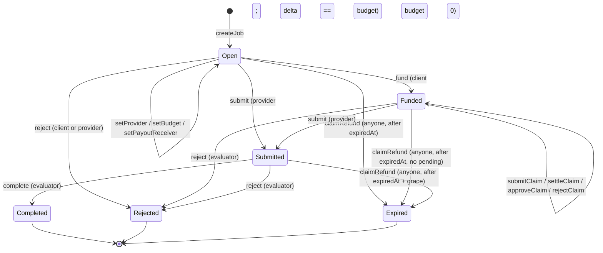

<!-- markdownlint-disable MD033 MD041 MD001 -->

<div align="center">

# Market Contract

### ERC-8183 Agentic Commerce Protocol Implementation

[](LICENSE)
[](https://soliditylang.org/)
[](https://book.getfoundry.sh/)

A non-upgradeable ERC-8183 kernel: per-job ERC-20 escrow with evaluator attestation, role mutex, fund-amount delta check, fee snapshots, and optional hooks.

Spec: [`3rdparty/base-contracts/eip.md`](3rdparty/base-contracts/eip.md).

</div>

## Overview

ERC-8183 defines a protocol where a **client** locks funds, a **provider** submits work, and an **evaluator** attests completion or rejection. This kernel implements that state machine with per-job payment tokens, a provider-chosen payout receiver, and an evaluation grace period on Submitted refunds.

### Job Lifecycle


```mermaid
stateDiagram-v2
    [*] --> Open: createJob
    Open --> Open: setProvider / setBudget / setPayoutReceiver
    Open --> Funded: fund (client; delta == budget)
    Open --> Submitted: submit (provider; budget == 0)
    Open --> Rejected: reject (client or provider)
    Open --> Expired: claimRefund (anyone, after expiredAt)
    Funded --> Funded: submitClaim / settleClaim / approveClaim / rejectClaim
    Funded --> Submitted: submit (provider)
    Funded --> Rejected: reject (evaluator)
    Funded --> Expired: claimRefund (anyone, after expiredAt, no pending)
    Submitted --> Completed: complete (evaluator)
    Submitted --> Rejected: reject (evaluator)
    Submitted --> Expired: claimRefund (anyone, after expiredAt + grace)
    Completed --> [*]
    Rejected --> [*]
    Expired --> [*]
```

## Features

### Core Protocol

- **Local-spec ABI** — `createJob(..., hook, providerAgentId)`, provider-only `setBudget(token, amount)`, `fund(expectedToken, expectedBudget)` selector `0x1f989ec8`
- **Per-job payment token** — admin allowlist; constructor does not take a token
- **Role mutex** — `client != provider`, `provider != evaluator`. `evaluator == client` is the DIY mode
- **Fund delta check** — `balanceOf` must increase by exactly `budget` (`UnexpectedFundedAmount` otherwise)
- **Evaluation grace period** — Submitted `claimRefund` waits `expiredAt + 1 hours`
- **Payout receiver + IDisburser** — optional callback at payout time (ERC-165, not cached)
- **Claim settlement** — cumulative `submitClaim` / `settleClaim` / `approveClaim` / `rejectClaim` on `settledAmount` while Funded; snapshotted fees on each delta
- **Non-hookable `claimRefund`** — Open, Funded, and Submitted (after grace) can expire

### Security

- **Non-upgradeable Ownable2Step** — no pause, no `emergencyWithdraw`, `renounceOwnership` disabled
- **Fee snapshot at `fund`** — `fundedPlatformFeeBp`, `fundedEvaluatorFeeBp`, `fundedTreasury`. Live admin changes do not rewrite in-flight jobs
- **`MAX_FEE_BP = 5000`** — combined platform + evaluator cap is 50%
- **Hook gas limit 500_000** — EIP-150 63/64 leftover still applies; callers must over-provision
- **SafeERC20** + **ReentrancyGuardTransient** (Cancun)

A receiver that advertises `IDisburser` and reverts in `onDisbursement` rolls back `complete` / `settleClaim` / `approveClaim`, including fees. Evaluator `reject` refunds the client. Snapshotted treasury that cannot receive tokens has the same recovery path. No admin snapshot repair. Floor division on each delta may sum to slightly less fee than one `complete` over the same total.

Do not send ETH; there is no withdraw.

### Hooks

- **`IERC8183Hook`** — `beforeAction` / `afterAction` with `caller` in the encoded `data`
- **Hookable:** `setBudget`, `fund`, `submit`, `complete`, `reject`, `submitClaim`, `settleClaim`, `approveClaim`, `rejectClaim`
- **Not hookable:** `createJob`, `setProvider`, `setPayoutReceiver`, `claimRefund`
- **`batchDetachHook`** — owner liveness tool; strips `job.hook`

Bidding stays off-chain: client `setProvider`, then provider `setBudget`. Third-party `SEL_FUND = fund(uint256,uint256,bytes)` (`0xd2e13f50`) will not route this kernel.

## Contract Constants

| Constant | Value | Description |
| -------- | ----- | ----------- |
| `MAX_FEE_BP` | `5000` | Maximum total fee: 50% (platform + evaluator) |
| `BP_DENOMINATOR` | `10_000` | Basis point denominator |
| `HOOK_GAS_LIMIT` | `500_000` | Max gas forwarded to each hook call |
| `MIN_EXPIRY_DURATION` | `5 minutes` | Minimum job time-to-live |
| `MAX_DESCRIPTION_LENGTH` | `1024` | Max job description size in bytes |
| `EVALUATION_GRACE_PERIOD` | `1 hours` | Submitted `claimRefund` wait after `expiredAt` |

## Quick Start

### Prerequisites

- [Foundry](https://book.getfoundry.sh/getting-started/installation) (forge ≥ 0.3.0)
- Solidity 0.8.28+ (solc 0.8.34)
- EVM target: Cancun (EIP-1153)

### Build

```bash
forge build
```

### Test

```bash
forge test -vv
```

### Deploy

```bash
export TREASURY=0x...           # Platform fee recipient
export PLATFORM_FEE_BP=250      # 2.5% platform fee
export EVALUATOR_FEE_BP=100     # 1% evaluator fee
export PAYMENT_TOKEN=0x...      # Optional post-deploy allowlist

forge script script/DeployERC8183.s.sol:DeployERC8183 \
  --rpc-url $RPC_URL --broadcast --verify
```

Same address across chains requires identical bytecode (solc 0.8.34, optimizer 200, `via_ir = false`), identical salt, Arachnid CREATE2 factory, and identical `(platformFeeBp, evaluatorFeeBp, treasury, owner)`. Per-chain tokens are allowlisted after deploy.

See [Deployment Guide](docs/DEPLOYMENT.md).

## Spec Compliance

This implementation follows `3rdparty/base-contracts/eip.md` (not the February 2026 minimal ABI).

| Requirement | Status |
| ----------- | ------ |
| Role mutex (`client != provider`, `provider != evaluator`) | MUST |
| Per-job payment token; provider-only `setBudget(token, amount)` | MUST |
| `fund(expectedToken, expectedBudget)` selector `0x1f989ec8` | MUST |
| Fund `balanceOf` delta equals budget | MUST |
| Evaluation grace period on Submitted `claimRefund` | MUST |
| Open → Expired via `claimRefund`; provider may reject Open | MUST |
| Payout receiver + optional `IDisburser` | MUST |
| Non-hookable `claimRefund` | MUST |
| Incremental claim settlement (`submitClaim` / `settleClaim` / `approveClaim` / `rejectClaim`) | MUST |
| Hook gas 500k; hook `data` encodes `caller` | MUST |
| Fee snapshot at fund; 50% cap | this kernel |
| Non-upgradeable; no pause; no admin escrow withdrawal | this kernel |

Public getters diverge from the UUPS reference on purpose: `treasury` not `platformTreasury`; `_jobs` is internal; `getJob` / `getFeeSnapshot` revert `JobDoesNotExist`.

## Installation

```bash
forge install qntx/market-contract
```

```toml
remappings = [
    "market-contract/=lib/market-contract/src/",
]
```

```solidity
import {ERC8183} from "market-contract/ERC8183.sol";
import {IERC8183} from "market-contract/interfaces/IERC8183.sol";
import {IERC8183Hook} from "market-contract/interfaces/IERC8183Hook.sol";
```

## Hook Development

Implement `IERC8183Hook` and ERC-165-advertise `0x7ff6bc9e`. See [Hook Development Guide](docs/HOOK_DEVELOPMENT.md) for the encoding table, 63/64 leftover, and `SEL_FUND` warning.

## License

This project is licensed under the MIT License — see the [LICENSE](LICENSE) file for details.

---

<div align="center">

A **[QuantX](https://qntx.org)** open-source project.

<a href="https://qntx.org"></a>

Code is law. We write both.

</div>
