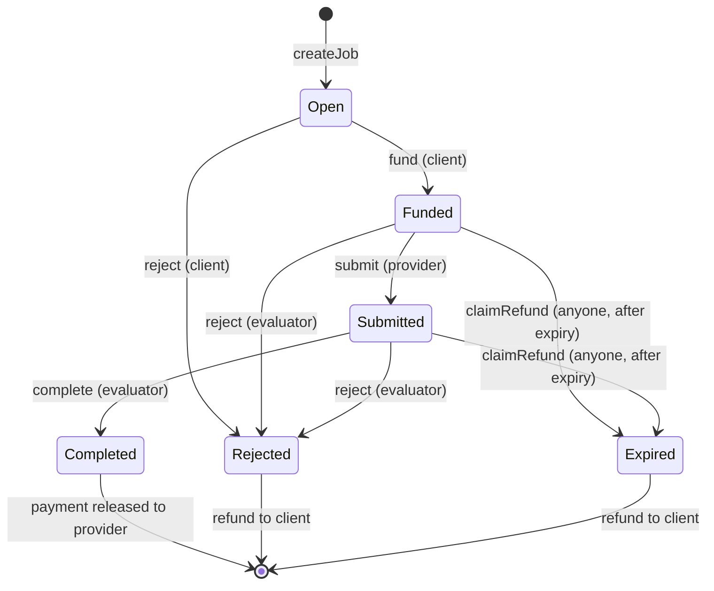

<!-- markdownlint-disable MD033 MD041 MD001 -->

<div align="center">

# Market Contract

### ERC-8183 Agentic Commerce Protocol Implementation

[](LICENSE)
[](https://soliditylang.org/)
[](https://book.getfoundry.sh/)
[](test/)

A production-ready, gas-optimized implementation of [ERC-8183: Agentic Commerce](https://eips.ethereum.org/EIPS/eip-8183) — trustless job escrow with evaluator attestation for autonomous agent commerce.

</div>

## Overview

ERC-8183 defines a protocol where a **client** locks funds, a **provider** submits work, and an **evaluator** attests completion or rejection. This contract manages the full job lifecycle with strict state machine enforcement, optional hook extensibility, and snapshot-based fee distribution.

### Job Lifecycle


```mermaid
stateDiagram-v2
    [*] --> Open: createJob
    Open --> Funded: fund (client)
    Open --> Rejected: reject (client)
    Funded --> Submitted: submit (provider)
    Funded --> Rejected: reject (evaluator)
    Funded --> Expired: claimRefund (anyone, after expiry)
    Submitted --> Completed: complete (evaluator)
    Submitted --> Rejected: reject (evaluator)
    Submitted --> Expired: claimRefund (anyone, after expiry)
    Completed --> [*]: payment released to provider
    Rejected --> [*]: refund to client
    Expired --> [*]: refund to client
```

## Features

### Core Protocol

- **ERC-8183 compliant** — strict adherence to the specification interface (`IERC8183`)
- **Single ERC-20 escrow** — immutable `PAYMENT_TOKEN` per deployment
- **Evaluator attestation** — only the evaluator can complete or reject submitted work
- **Front-running protection** — `fund()` requires `expectedBudget` to match current budget
- **Expiry enforcement** — cannot fund already-expired jobs; `claimRefund` always available after expiry

### Gas Optimization

- **Storage packing** — `JobStorage` struct optimized to 8 slots with packed fields (`hook + status + expiredAt + fees` in a single slot)
- **ReentrancyGuardTransient** — EIP-1153 transient storage for cheaper reentrancy protection
- **Immutable variables** — `PAYMENT_TOKEN` stored in bytecode, zero SLOAD cost

### Security

- **Ownable2Step** — two-step ownership transfer prevents accidental transfers; `renounceOwnership()` is permanently disabled
- **SafeERC20** — safe token transfers with return value checks
- **Fee snapshot** — `platformFeeBp`, `evaluatorFeeBp`, and `treasury` captured at `fund()` time, immune to admin changes
- **Hook gas limit** — 500k gas cap prevents griefing attacks via malicious hooks
- **Non-hookable `claimRefund`** — funds are always recoverable after expiry, even if the hook is malicious

### Hook Extensibility

- **Optional hooks** — `IACPHook` interface for `beforeAction` / `afterAction` callbacks on 6 core operations
- **Hook whitelist** — admin-controlled allowlist with ERC-165 interface validation
- **BaseACPHook** — abstract router that decodes calldata and dispatches to named virtual functions

## Contract Constants

| Constant | Value | Description |
| -------- | ----- | ----------- |
| `MAX_FEE_BP` | `5000` | Maximum total fee: 50% (platform + evaluator) |
| `BP_DENOMINATOR` | `10_000` | Basis point denominator |
| `HOOK_GAS_LIMIT` | `500_000` | Max gas forwarded to each hook call |
| `MIN_EXPIRY_DURATION` | `5 minutes` | Minimum job time-to-live |
| `MAX_DESCRIPTION_LENGTH` | `1024` | Max job description size in bytes |

## Quick Start

### Prerequisites

- [Foundry](https://book.getfoundry.sh/getting-started/installation) (forge ≥ 0.3.0)
- Solidity 0.8.28+
- EVM target: Cancun (EIP-1153 transient storage support required)

### Build

```bash
forge build
```

### Test

```bash
forge test -vvv
```

All **126 tests** passing across 4 test suites covering state transitions, role checks, fee calculations, hook interactions, reentrancy protection, gas limits, edge cases, and fuzz testing.

### Deploy

```bash
export PAYMENT_TOKEN=0x...      # ERC-20 token address
export TREASURY=0x...           # Platform fee recipient
export PLATFORM_FEE_BP=250      # 2.5% platform fee
export EVALUATOR_FEE_BP=100     # 1% evaluator fee

forge script script/DeployAgenticCommerce.s.sol:DeployAgenticCommerce \
  --rpc-url $RPC_URL --broadcast --verify
```

See [Deployment Guide](docs/DEPLOYMENT.md) for full instructions including hardware wallet, Gnosis Safe, multi-chain, and post-deployment verification.

## Spec Compliance

This implementation covers all **MUST/SHALL** requirements of ERC-8183:

| Requirement | Status |
| ----------- | ------ |
| 6 states (Open, Funded, Submitted, Completed, Rejected, Expired) | ✅ |
| 8 valid state transitions, no others | ✅ |
| 8 core functions with correct role checks | ✅ |
| 8 events emitted on corresponding transitions | ✅ |
| Hook gas limits (500k) | ✅ |
| Non-hookable `claimRefund` | ✅ |
| SafeERC20 + ReentrancyGuard | ✅ |

### Beyond Spec

- **Fee snapshot at fund time** — prevents admin fee changes from affecting funded jobs
- **Expiry check in `fund()`** — cannot fund already-expired jobs
- **Hook whitelist with ERC-165** — only validated hooks can be attached
- **Disabled `renounceOwnership()`** — prevents irreversible loss of admin control

## Installation

Install as a Foundry dependency:

```bash
forge install qntx/market-contract
```

Add the remapping to your `foundry.toml`:

```toml
remappings = [
    "market-contract/=lib/market-contract/src/",
]
```

Import in your contracts:

```solidity
import {AgenticCommerce} from "market-contract/AgenticCommerce.sol";
import {BaseACPHook} from "market-contract/BaseACPHook.sol";
import {IERC8183} from "market-contract/interfaces/IERC8183.sol";
import {IACPHook} from "market-contract/interfaces/IACPHook.sol";
```

## Hook Development

Extend protocol functionality by implementing `IACPHook` via `BaseACPHook`:

```solidity
import {BaseACPHook} from "market-contract/BaseACPHook.sol";

contract MyHook is BaseACPHook {
    constructor(address acp) BaseACPHook(acp) {}

    function _preFund(uint256 jobId, bytes memory optParams) internal override {
        // Custom validation — revert to block the fund operation
    }

    function _postComplete(
        uint256 jobId, bytes32 reason, bytes memory optParams
    ) internal override {
        // Post-completion logic — state and transfers already finalized
    }
}
```

Register hooks via `setHookWhitelist(address, true)` before attaching to jobs.

See [Hook Development Guide](docs/HOOK_DEVELOPMENT.md) for the complete reference including cookbook patterns, security guidelines, and advanced topics.

## License

This project is licensed under the MIT License — see the [LICENSE](LICENSE) file for details.

---

<div align="center">

A **[QuantX](https://qntx.org)** open-source project.

<a href="https://qntx.org"></a>

Code is law. We write both.

</div>
