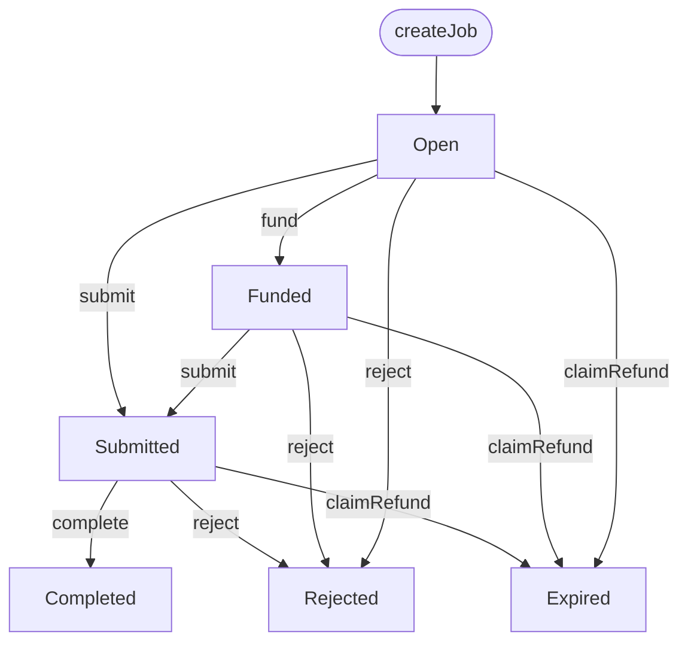

<!-- markdownlint-disable MD033 MD041 MD001 -->

<div align="center">

# Market Contract

### ERC-8183 Agentic Commerce kernel

[](LICENSE)
[](https://soliditylang.org/)
[](https://book.getfoundry.sh/)
[](https://github.com/qntx/market-contract/actions/workflows/ci.yml)

Non-upgradeable per-job ERC-20 escrow with evaluator attestation.

</div>

## Overview

[ERC-8183](https://eips.ethereum.org/EIPS/eip-8183) defines a job protocol: a **client** locks funds, a **provider** submits work, an **evaluator** attests completion or rejection. This repository implements that state machine as a non-upgradeable kernel with per-job payment tokens, a provider-chosen payout receiver, incremental claim settlement while Funded, and a one-hour evaluation grace period on Submitted refunds.

The ERC is the public spec. The [Spec](#spec) table lists this kernel's extras where the February draft is silent or different.

### Job lifecycle

Status-changing transitions only. Open mutators and Funded claims do not change `JobStatus` — see the tables.


```mermaid
flowchart TB
    createJob([createJob]) --> Open
    Open -->|fund| Funded
    Funded -->|submit| Submitted
    Submitted -->|complete| Completed
    Open -->|submit| Submitted
    Open -->|reject| Rejected
    Funded -->|reject| Rejected
    Submitted -->|reject| Rejected
    Open -->|claimRefund| Expired
    Funded -->|claimRefund| Expired
    Submitted -->|claimRefund| Expired
```

**Transition guards** (not mermaid edges):

| From → To | Call | Actor | Guards (`src/ERC8183.sol`) |
| --------- | ---- | ----- | -------------------------- |
| — → Open | `createJob` | client | evaluator ≠ 0; `expiredAt > now + MIN_EXPIRY_DURATION` (5 minutes); hook is zero or (whitelisted **and** ERC-165 `IERC8183Hook`); provider is zero or mutex (`≠ client`, `≠ evaluator`) |
| Open → Funded | `fund` | client | provider set; not expired; expected token/budget match; allowlisted token; `balanceOf` delta == budget **iff** `budget > 0` (zero-budget: no transfer) |
| Open → Submitted | `submit` | provider | provider ≠ 0; `budget == 0`; not expired |
| Open → Rejected | `reject` | client or provider | Open only |
| Open → Expired | `claimRefund` | anyone | `timestamp >= expiredAt` |
| Funded → Submitted | `submit` | provider | not expired; pending claim superseded if present (does not revert) |
| Funded → Rejected | `reject` | evaluator | **no** expiry check |
| Funded → Expired | `claimRefund` | anyone | `timestamp >= expiredAt`; no pending claim |
| Submitted → Completed | `complete` | evaluator | Submitted; **no** expiry check (still valid after `expiredAt`) |
| Submitted → Rejected | `reject` | evaluator | **no** expiry check |
| Submitted → Expired | `claimRefund` | anyone | `timestamp >= expiredAt + 1 hours` |

**Same-status actions** (table, not mermaid):

| State | Call | Actor | Notes |
| ----- | ---- | ----- | ----- |
| Open | `setProvider` | client | once; not expired; provider ≠ 0, ≠ client, ≠ evaluator; not hookable |
| Open | `setBudget` | **provider** | not expired; `(token, amount)`; token allowlisted; amount 0 allowed |
| Open | `setPayoutReceiver` | provider | not expired; ≠ this contract, ≠ payment token; not hookable |
| Funded | `submitClaim` | provider | no pending; not expired; cumulative in `(settledAmount, budget]` |
| Funded | `settleClaim` | client | not expired; pays delta; does **not** consume pending |
| Funded | `approveClaim` | client or evaluator | pending hash match; **no** expiry check |
| Funded | `rejectClaim` | client, evaluator, or provider | pending hash match; **no** expiry check |

Completed, Rejected, and Expired are terminal.

## Features

- Per-job ERC-20 from an owner allowlist. Constructor does not take a token.
- Role mutex: `client != provider`, `provider != evaluator` (this kernel; not a published ERC SHALL). `evaluator == client` is the no-third-party mode (ERC + this kernel).
- `fund` with `budget > 0` pulls exactly `budget` (`UnexpectedFundedAmount` if the ERC-20 delta differs). Zero-budget `fund` succeeds with no transfer.
- Full-job path: `submit` → evaluator `complete` / `reject`. Incremental path: `submitClaim` / `settleClaim` / `approveClaim` / `rejectClaim` while Funded.
- Optional `IERC8183Hook`. `createJob`, `setProvider`, `setPayoutReceiver`, and `claimRefund` are not hookable.
- `ERC8183WithAuthorization` — same kernel, EIP-712 inner signatures for relayers.

## Security

- Non-upgradeable `Ownable2Step`. No pause, no `emergencyWithdraw`. `renounceOwnership` reverts.
- Fee bps and treasury snapshot at `fund`. Live admin changes do not rewrite in-flight jobs. Combined cap `MAX_FEE_BP = 5000`.
- `claimRefund` is not hookable. A reverting hook can still pin a Funded pending claim (`PendingClaimExists`); owner `batchDetachHook` is the liveness tool.
- A payout receiver that advertises `IDisburser` and reverts in `onDisbursement` rolls back `complete` / `settleClaim` / `approveClaim`. Evaluator `reject` refunds the client.
- Do not send ETH; there is no withdraw. Allowlist is not a proof of plain ERC-20.

Operational detail (IDisburser, snapshotted treasury, fee floor-division across claim deltas, incident procedures): [Operations](docs/OPERATIONS.md). Hook gas stipend and 63/64 leftover: [Hook Development](docs/HOOK_DEVELOPMENT.md).

## Contract Constants

| Constant | Value | Description |
| -------- | ----- | ----------- |
| `MAX_FEE_BP` | `5000` | Maximum total fee: 50% (platform + evaluator) |
| `BP_DENOMINATOR` | `10_000` | Basis point denominator |
| `HOOK_GAS_LIMIT` | `500_000` | Max gas forwarded to each hook call |
| `MIN_EXPIRY_DURATION` | `5 minutes` | Minimum job time-to-live |
| `MAX_DESCRIPTION_LENGTH` | `1024` | Max job description size in bytes |
| `EVALUATION_GRACE_PERIOD` | `1 hours` | Submitted `claimRefund` wait after `expiredAt` |

## Quick Start

### Prerequisites

- [Foundry](https://book.getfoundry.sh/getting-started/installation) (forge ≥ 0.3.0)
- Solidity 0.8.28+ (solc 0.8.34)
- EVM target: Cancun (EIP-1153)

### Build

```bash
forge build
```

### Test

```bash
forge test -vv
```

CI on `main` runs `forge test -vvv` via [`.github/workflows/ci.yml`](https://github.com/qntx/market-contract/actions/workflows/ci.yml).

### Deploy

Constructor: `(uint256 platformFeeBp_, uint256 evaluatorFeeBp_, address treasury_, address owner_)`. There is no payment-token constructor argument.

```bash
export TREASURY=0x...           # Platform fee recipient
export PLATFORM_FEE_BP=250      # 2.5% platform fee
export EVALUATOR_FEE_BP=100     # 1% evaluator fee
export PAYMENT_TOKEN=0x...      # Optional; allowlisted after deploy if owner broadcasts

forge script script/DeployERC8183.s.sol:DeployERC8183 \
  --rpc-url $RPC_URL --broadcast --verify
```

Same address across chains requires identical compiler bytecode (solc 0.8.34, optimizer 200, `via_ir = false`), identical salt, Arachnid CREATE2 factory, and identical `(platformFeeBp, evaluatorFeeBp, treasury, owner)`. Solidity appends a CBOR metadata hash; natspec edits change that suffix. Runtime opcodes and ABI stay the same; CREATE2 addresses do not. Per-chain tokens are allowlisted after deploy.

See [Deployment Guide](docs/DEPLOYMENT.md).

## Spec

Public spec: [ERC-8183](https://eips.ethereum.org/EIPS/eip-8183) (Draft, 2026-02-25). This kernel implements the job lifecycle and then adds a larger ABI. It does **not** match the February `fund(uint256,uint256,bytes)` surface.

| Behavior | Where |
| -------- | ----- |
| Six states: Open, Funded, Submitted, Completed, Rejected, Expired | ERC + this kernel |
| `evaluator == client` allowed (no third party) | ERC + this kernel |
| Role mutex (`client != provider`, `provider != evaluator`) | this kernel |
| Provider MAY be zero at `createJob`; client `setProvider` before `fund` | ERC + this kernel |
| Optional `hook` at `createJob` | ERC + this kernel |
| Per-job payment token; provider-only `setBudget(token, amount)` | this kernel (ERC: client or provider `setBudget(amount)`; per-job token is MAY, not the ABI here) |
| `fund(expectedToken, expectedBudget)` | this kernel (ERC `fund(expectedBudget)`) |
| Fund `balanceOf` delta equals budget when `budget > 0` | this kernel |
| Zero-budget `fund` succeeds (no transfer) | this kernel (ERC SHALL revert if budget is zero) |
| Open → Submitted when `budget == 0` | this kernel (ERC `submit` is Funded-only) |
| Open → Expired via `claimRefund`; provider may `reject` Open | this kernel (ERC: Open reject is client-only; `claimRefund` is Funded/Submitted) |
| Evaluation grace (`expiredAt + 1 hours`) on Submitted `claimRefund` | this kernel |
| `MIN_EXPIRY_DURATION` = 5 minutes | this kernel (ERC: `expiredAt` not in the future) |
| Payout receiver + optional `IDisburser` (probed at payout, not cached) | this kernel |
| Incremental claims (`submitClaim` / `settleClaim` / `approveClaim` / `rejectClaim`) | this kernel |
| `providerAgentId`; hook whitelist + ERC-165 at `createJob`; `setProvider` not hookable | this kernel (ERC marks `setProvider` hookable) |
| Hook `data` leads with `caller`; stipend 500_000 gas | this kernel |
| Non-hookable `claimRefund` | ERC + this kernel |
| Fee snapshot at `fund`; combined cap 50% | this kernel |
| Non-upgradeable; no pause; no admin escrow withdrawal | this kernel |

Public getters diverge from UUPS reference implementations on purpose: `treasury` not `platformTreasury`; `_jobs` is internal; `getJob` / `getFeeSnapshot` revert `JobDoesNotExist`.

## Installation

```bash
forge install qntx/market-contract
```

```toml
remappings = [
    "market-contract/=lib/market-contract/src/",
]
```

```solidity
import {ERC8183} from "market-contract/ERC8183.sol";
import {ERC8183WithAuthorization} from "market-contract/ERC8183WithAuthorization.sol";
import {IERC8183} from "market-contract/interfaces/IERC8183.sol";
import {IERC8183Hook} from "market-contract/interfaces/IERC8183Hook.sol";
import {BaseERC8183Hook} from "market-contract/BaseERC8183Hook.sol";
```

## Facilitators

`ERC8183WithAuthorization` is separate bytecode that inherits the kernel and adds ERC-3009-style EIP-712 authorizations. Relayers call `*WithAuthorization`; kernel internals run with `actor = signer`. There is no ERC-2771 forwarder.

- Domain: name `"ERC8183"`, version `"1"` (`DOMAIN_SEPARATOR()`)
- Unordered packed nonces: `bytes32((uint256(uint160(signer)) << 96) | uint256(nonce))`
- ERC-1271 via OpenZeppelin `SignatureChecker`
- `completeWithAuthorization` / `rejectWithAuthorization` bind `submittedAt` from storage so a pre-submit signature cannot apply after submit
- `cancelAuthorization(uint72 nonce)` is signer-only (not relayable)
- Hooks and `onDisbursement` still receive canonical kernel selectors (`complete`, `fund`, …), never `*WithAuthorization`

Same constructor args as `ERC8183`. Different bytecode ⇒ different address.

```bash
forge script script/DeployERC8183WithAuthorization.s.sol:DeployERC8183WithAuthorization \
  --rpc-url $RPC_URL --broadcast --verify
```

## Documentation

- [Hook Development](docs/HOOK_DEVELOPMENT.md) — encoding table, claim virtuals, gas stipend, February `fund` selector warning
- [Deployment](docs/DEPLOYMENT.md) — constructor, CREATE2, allowlist
- [Operations](docs/OPERATIONS.md) — admin, refunds, incident response

## License

This project is licensed under the MIT License — see the [LICENSE](LICENSE) file for details.

---

<div align="center">

A **[QuantX](https://qntx.org)** open-source project.

<a href="https://qntx.org"></a>

Code is law. We write both.

</div>
