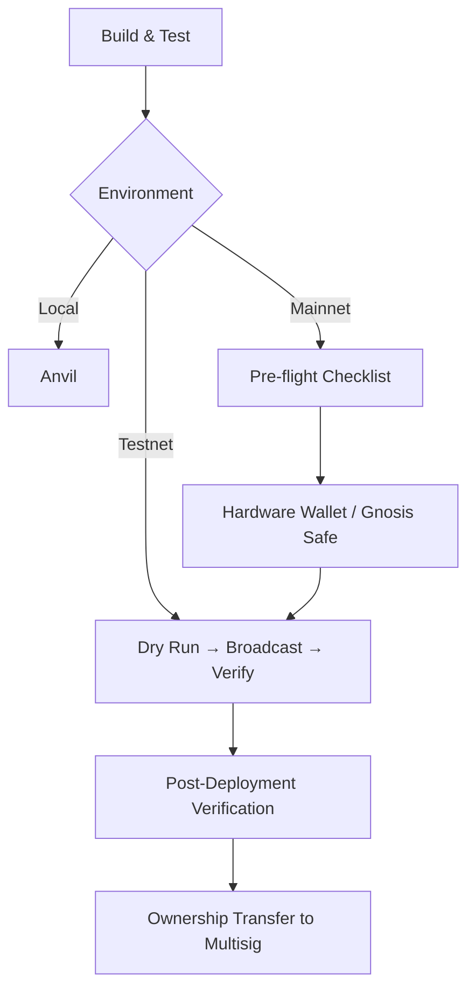

# Deployment Guide

Complete deployment guide for AgenticCommerce (ERC-8183) smart contracts.

## Prerequisites

| Tool | Version | Purpose |
| ---- | ------- | ------- |
| [Foundry](https://book.getfoundry.sh/) | ≥ 0.3.0 | Build, test, deploy |
| Solidity | 0.8.28+ | Compiler |
| EVM target | Osaka | EIP-1153 transient storage support |

> **Important:** The contract uses `ReentrancyGuardTransient` (EIP-1153), which requires the target chain to support the `TSTORE`/`TLOAD` opcodes. Chains without Osaka (Cancun+) EVM support will fail at deployment.

### Verify Installation

```bash
forge --version
forge build
forge test -vvv
```

Ensure **all 126 tests pass** before any deployment.

---

## Environment Setup

Create a `.env` file at the project root (**never commit this file**):

```bash
# .env
PRIVATE_KEY=0x...                    # Deployer private key
RPC_URL=https://...                  # Target chain RPC endpoint
ETHERSCAN_API_KEY=...                # Block explorer API key (for verification)

# Contract parameters
PAYMENT_TOKEN=0x...                  # ERC-20 token address for escrow
TREASURY=0x...                       # Platform fee recipient (multisig recommended)
PLATFORM_FEE_BP=250                  # Platform fee: 250 = 2.5%
EVALUATOR_FEE_BP=100                 # Evaluator fee: 100 = 1.0%
OWNER=0x...                          # Contract owner (multisig recommended, optional)
```

```bash
source .env
```

> `.env` is already in `.gitignore`. Never commit secrets.

---

## Configuration Parameters

### Constructor Parameters

| Parameter | Type | Required | Description |
| --------- | ---- | -------- | ----------- |
| `paymentToken_` | `address` | Yes | ERC-20 token used for all escrow payments |
| `platformFeeBp_` | `uint256` | Yes | Platform fee in basis points |
| `evaluatorFeeBp_` | `uint256` | Yes | Evaluator fee in basis points |
| `treasury_` | `address` | Yes | Recipient of platform fees |
| `owner_` | `address` | Yes | Contract admin (Ownable2Step) |

### Parameter Constraints

| Constraint | Rule | Error |
| ---------- | ---- | ----- |
| `paymentToken_` | `!= address(0)` | `ZeroAddress()` |
| `treasury_` | `!= address(0)` | `ZeroAddress()` |
| `platformFeeBp_ + evaluatorFeeBp_` | `≤ 5000` (50%) | `FeeTooHigh()` |

### Immutable Values (Cannot Change After Deployment)

| Constant | Value | Notes |
| -------- | ----- | ----- |
| `PAYMENT_TOKEN` | Constructor arg | One ERC-20 per deployment |
| `MAX_FEE_BP` | `5000` | Total fee cap: 50% |
| `BP_DENOMINATOR` | `10_000` | Basis point denominator |
| `HOOK_GAS_LIMIT` | `500_000` | Max gas forwarded to hooks |
| `MIN_EXPIRY_DURATION` | `5 minutes` | Minimum job TTL |
| `MAX_DESCRIPTION_LENGTH` | `1024` | Max job description bytes |

### Mutable Values (Owner Can Change)

| Parameter | Function | Constraint |
| --------- | -------- | ---------- |
| `platformFeeBp` | `setPlatformFee()` | `+ evaluatorFeeBp ≤ 5000` |
| `evaluatorFeeBp` | `setEvaluatorFee()` | `+ platformFeeBp ≤ 5000` |
| `treasury` | `setTreasury()` | `!= address(0)` |
| `whitelistedHooks[addr]` | `setHookWhitelist()` | `hook != address(0)` |
| `owner` | `transferOwnership()` | Two-step via Ownable2Step |

> **Note:** Fee changes only affect **future** `fund()` calls. Already-funded jobs use the fee snapshot taken at fund time.

### Token Compatibility

| Token Type | Supported | Notes |
| ---------- | --------- | ----- |
| Standard ERC-20 | ✅ | USDC, USDT, DAI, etc. |
| Fee-on-transfer | ❌ | Will cause accounting mismatch |
| Rebasing tokens | ❌ | Balance changes break escrow |
| ERC-777 | ⚠️ | Works but adds reentrancy surface (mitigated by guard) |
| Permit (ERC-2612) | ✅ | Supported but `approve` still required separately |

---

## Deployment Flow



---

## Local Deployment (Anvil)

```bash
anvil --hardfork cancun
```

### Deploy Mock ERC-20 (if needed)

```bash
# Using Anvil's default account #0
forge create test/mocks/MockERC20.sol:MockERC20 \
  --rpc-url http://127.0.0.1:8545 \
  --private-key 0xac0974bec39a17e36ba4a6b4d238ff944bacb478cbed5efcae784d7bf4f2ff80
```

### Deploy AgenticCommerce

```bash
export PAYMENT_TOKEN=<mock_erc20_address>
export TREASURY=0x70997970C51812dc3A010C7d01b50e0d17dc79C8   # Anvil account #1
export PLATFORM_FEE_BP=250
export EVALUATOR_FEE_BP=100

forge script script/DeployAgenticCommerce.s.sol:DeployAgenticCommerce \
  --rpc-url http://127.0.0.1:8545 \
  --private-key 0xac0974bec39a17e36ba4a6b4d238ff944bacb478cbed5efcae784d7bf4f2ff80 \
  --broadcast
```

---

## Testnet Deployment

### 1. Dry Run (Simulation)

```bash
forge script script/DeployAgenticCommerce.s.sol:DeployAgenticCommerce \
  --rpc-url $RPC_URL \
  --private-key $PRIVATE_KEY
```

Review the simulated output. No transaction is sent.

### 2. Broadcast

```bash
forge script script/DeployAgenticCommerce.s.sol:DeployAgenticCommerce \
  --rpc-url $RPC_URL \
  --private-key $PRIVATE_KEY \
  --broadcast \
  --verify \
  --etherscan-api-key $ETHERSCAN_API_KEY
```

### 3. Record Deployment

Save the deployed address in a deployment registry (e.g., `deployments/<network>.json`):

```json
{
  "network": "sepolia",
  "chainId": 11155111,
  "agenticCommerce": "0x...",
  "paymentToken": "0x...",
  "treasury": "0x...",
  "platformFeeBp": 250,
  "evaluatorFeeBp": 100,
  "owner": "0x...",
  "deployer": "0x...",
  "deployTxHash": "0x...",
  "blockNumber": 12345678,
  "timestamp": "2026-03-18T14:00:00Z"
}
```

---

## Mainnet Deployment

### Pre-Deployment Checklist

- [ ] All 126 tests pass: `forge test`
- [ ] Gas report reviewed: `forge test --gas-report`
- [ ] Code audited and findings addressed
- [ ] `PAYMENT_TOKEN` is the correct mainnet token address
- [ ] `TREASURY` is a multisig wallet (e.g., Gnosis Safe)
- [ ] `OWNER` is a multisig wallet (strongly recommended)
- [ ] Fee parameters reviewed: `platformFeeBp + evaluatorFeeBp ≤ 5000`
- [ ] Target chain supports EIP-1153 (transient storage)
- [ ] Deployment wallet has sufficient ETH for gas
- [ ] `.env` values double-checked (wrong address = permanent loss)

### Using Hardware Wallet

```bash
forge script script/DeployAgenticCommerce.s.sol:DeployAgenticCommerce \
  --rpc-url $RPC_URL \
  --ledger \
  --sender $DEPLOYER_ADDRESS \
  --broadcast \
  --verify \
  --etherscan-api-key $ETHERSCAN_API_KEY
```

### Ownership Transfer to Multisig

If deployed with an EOA, transfer ownership to a multisig immediately:

```bash
# Step 1: Initiate transfer (current owner)
cast send $AC_ADDRESS "transferOwnership(address)" $MULTISIG_ADDRESS \
  --rpc-url $RPC_URL --private-key $PRIVATE_KEY

# Step 2: Accept transfer (multisig must call)
cast send $AC_ADDRESS "acceptOwnership()" \
  --rpc-url $RPC_URL --private-key $MULTISIG_PRIVATE_KEY
```

> **Warning:** `renounceOwnership()` is disabled (reverts with `Unauthorized()`). This is intentional — the contract is non-upgradeable and losing admin control is irreversible.

---

## Post-Deployment Verification

### Source Code Verification

If `--verify` failed during deployment:

```bash
forge verify-contract $AC_ADDRESS \
  src/AgenticCommerce.sol:AgenticCommerce \
  --chain-id $CHAIN_ID \
  --constructor-args $(cast abi-encode "constructor(address,uint256,uint256,address,address)" \
    $PAYMENT_TOKEN $PLATFORM_FEE_BP $EVALUATOR_FEE_BP $TREASURY $OWNER) \
  --etherscan-api-key $ETHERSCAN_API_KEY
```

### On-Chain State Validation

```bash
# Payment token
cast call $AC_ADDRESS "PAYMENT_TOKEN()(address)" --rpc-url $RPC_URL

# Fee configuration
cast call $AC_ADDRESS "platformFeeBp()(uint256)" --rpc-url $RPC_URL
cast call $AC_ADDRESS "evaluatorFeeBp()(uint256)" --rpc-url $RPC_URL

# Treasury
cast call $AC_ADDRESS "treasury()(address)" --rpc-url $RPC_URL

# Owner
cast call $AC_ADDRESS "owner()(address)" --rpc-url $RPC_URL

# ERC-165 interface support
cast call $AC_ADDRESS "supportsInterface(bytes4)(bool)" "0x01ffc9a7" --rpc-url $RPC_URL  # IERC165
cast call $AC_ADDRESS "supportsInterface(bytes4)(bool)" \
  $(cast sig "createJob(address,address,uint256,string,address)" | head -c 10) --rpc-url $RPC_URL
```

### Smoke Test (Testnet Only)

```bash
# Approve token spending
cast send $TOKEN "approve(address,uint256)" $AC_ADDRESS 1000000 \
  --rpc-url $RPC_URL --private-key $PRIVATE_KEY

# Create job
cast send $AC_ADDRESS \
  "createJob(address,address,uint256,string,address)" \
  $PROVIDER $EVALUATOR $(( $(date +%s) + 3600 )) "smoke test" 0x0000000000000000000000000000000000000000 \
  --rpc-url $RPC_URL --private-key $PRIVATE_KEY
```

---

## Hook Deployment

See [Hook Development Guide](./HOOK_DEVELOPMENT.md) for implementation details.

```bash
# Deploy hook
forge create src/hooks/MyHook.sol:MyHook \
  --constructor-args $AC_ADDRESS \
  --rpc-url $RPC_URL \
  --private-key $PRIVATE_KEY \
  --verify --etherscan-api-key $ETHERSCAN_API_KEY

# Whitelist hook (owner only)
cast send $AC_ADDRESS "setHookWhitelist(address,bool)" $HOOK_ADDRESS true \
  --rpc-url $RPC_URL --private-key $OWNER_PRIVATE_KEY

# Verify
cast call $AC_ADDRESS "whitelistedHooks(address)(bool)" $HOOK_ADDRESS --rpc-url $RPC_URL
```

---

## Multi-Chain Deployment

Deploy identical contracts across chains using deterministic deployment (CREATE2) for consistent addresses:

```bash
forge create src/AgenticCommerce.sol:AgenticCommerce \
  --constructor-args $PAYMENT_TOKEN $PLATFORM_FEE_BP $EVALUATOR_FEE_BP $TREASURY $OWNER \
  --rpc-url $RPC_URL \
  --private-key $PRIVATE_KEY \
  --create2 \
  --salt 0x0000000000000000000000000000000000000000000000000000000000000001
```

| Consideration | Details |
| ------------- | ------- |
| `PAYMENT_TOKEN` | Different address per chain (e.g., USDC on Ethereum ≠ USDC on Base) |
| `TREASURY` | Can be same multisig if chain-agnostic, otherwise deploy per chain |
| Gas costs | Varies significantly — test on each chain |
| EIP-1153 | Verify support on each target chain |

---

## Troubleshooting

| Error | Cause | Fix |
| ----- | ----- | --- |
| `ZeroAddress()` | `paymentToken` or `treasury` is `address(0)` | Provide valid addresses |
| `FeeTooHigh()` | `platformFeeBp + evaluatorFeeBp > 5000` | Reduce fee values |
| `EvmError: NotActivated` | Chain lacks EIP-1153 support | Deploy to Cancun+ compatible chain |
| `Failed to verify` | Wrong constructor args encoding | Re-run with explicit `--constructor-args` |
| `Nonce too high` | Pending transactions | Wait or speed up pending txs |

### Gas Estimation

Approximate gas costs (Ethereum mainnet, 200 optimizer runs):

| Operation | Gas |
| --------- | --- |
| Deploy `AgenticCommerce` | ~2,800,000 |
| `createJob` (no hook) | ~120,000 |
| `fund` (no hook) | ~90,000 |
| `complete` (with fees) | ~85,000 |
| `claimRefund` | ~55,000 |

> Run `forge test --gas-report` for precise measurements.
