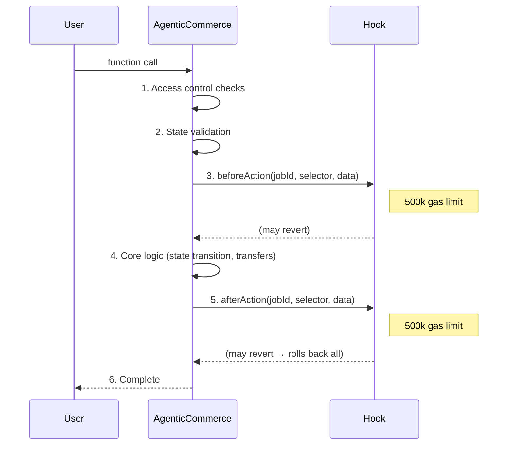

# Hook Development & Integration Guide

Complete guide for developing, testing, and deploying custom hooks for AgenticCommerce (ERC-8183).

## Overview

Hooks are **optional extension contracts** that receive callbacks before and after core AgenticCommerce operations. They enable protocol-level customization without modifying the core escrow contract.

### What Hooks Can Do

- **Validate** — enforce custom rules (KYC, bid verification, rate limits)
- **Gate** — restrict who can participate (allowlists, reputation thresholds)
- **Observe** — emit events, update on-chain analytics, trigger side-effects
- **Coordinate** — orchestrate multi-asset flows, cross-contract interactions

### What Hooks Cannot Do

- Modify AgenticCommerce storage directly
- Block `claimRefund` (deliberately non-hookable)
- Exceed 500,000 gas per call
- Bypass role-based access control on the core contract

### Hookable Functions

| Function | `beforeAction` | `afterAction` | Notes |
| -------- | :-: | :-: | ----- |
| `setProvider` | ✅ | ✅ | |
| `setBudget` | ✅ | ✅ | |
| `fund` | ✅ | ✅ | |
| `submit` | ✅ | ✅ | |
| `complete` | ✅ | ✅ | After: escrow already distributed |
| `reject` | ✅ | ✅ | After: refund already sent |
| `claimRefund` | ❌ | ❌ | Non-hookable by design |
| `createJob` | ❌ | ❌ | Not hookable |

---

## Architecture



### Key Properties

- **Pre-validation** — `beforeAction` runs after ACL checks but before state changes. Reverting here blocks the operation cleanly.
- **Post-observation** — `afterAction` runs after state changes and token transfers. Reverting here rolls back the **entire transaction** including transfers.
- **Gas isolation** — each hook call is capped at `HOOK_GAS_LIMIT` (500,000). If the hook exceeds this, the call reverts.
- **One hook per job** — set at `createJob()` time, immutable for the job's lifetime.

---

## Quick Start

### Minimal Hook (Using BaseACPHook)

```solidity
// SPDX-License-Identifier: MIT
pragma solidity ^0.8.28;

import {BaseACPHook} from "../src/BaseACPHook.sol";

contract MinimalHook is BaseACPHook {
    constructor(address acp_) BaseACPHook(acp_) {}

    function _preFund(uint256 jobId, bytes memory optParams) internal override {
        // Custom logic before fund()
        // Revert here to block the fund operation
    }

    function _postComplete(
        uint256 jobId, bytes32 reason, bytes memory optParams
    ) internal override {
        // Custom logic after complete()
        // State changes and transfers have already happened
    }
}
```

### Direct IACPHook Implementation

```solidity
// SPDX-License-Identifier: MIT
pragma solidity ^0.8.28;

import {IACPHook} from "../src/interfaces/IACPHook.sol";
import {IERC165} from "@openzeppelin/contracts/utils/introspection/IERC165.sol";

contract DirectHook is IACPHook {
    address public immutable ACP;

    constructor(address acp_) {
        ACP = acp_;
    }

    function beforeAction(
        uint256 jobId, bytes4 selector, bytes calldata data
    ) external override {
        require(msg.sender == ACP, "only ACP");
        // Route by selector or handle generically
    }

    function afterAction(
        uint256 jobId, bytes4 selector, bytes calldata data
    ) external override {
        require(msg.sender == ACP, "only ACP");
    }

    function supportsInterface(bytes4 interfaceId) external pure override returns (bool) {
        return interfaceId == type(IACPHook).interfaceId
            || interfaceId == type(IERC165).interfaceId;
    }
}
```

> **Recommendation:** Always use `BaseACPHook` unless you need custom selector routing. It handles ACL, ERC-165, and data decoding automatically.

---

## Hook Interface

### IACPHook

```solidity
interface IACPHook is IERC165 {
    function beforeAction(
        uint256 jobId,
        bytes4 selector,
        bytes calldata data
    ) external;

    function afterAction(
        uint256 jobId,
        bytes4 selector,
        bytes calldata data
    ) external;
}
```

- **`jobId`** — the job being operated on
- **`selector`** — 4-byte function selector identifying which operation is being performed
- **`data`** — ABI-encoded operation-specific arguments (see [Data Encoding Reference](#data-encoding-reference))

### ERC-165 Requirement

Hooks **must** implement ERC-165 and return `true` for `type(IACPHook).interfaceId`. AgenticCommerce validates this at `createJob()` time.

```solidity
function supportsInterface(bytes4 interfaceId) external pure returns (bool) {
    return interfaceId == type(IACPHook).interfaceId
        || interfaceId == type(IERC165).interfaceId;
}
```

---

## BaseACPHook Router

`BaseACPHook` is an abstract contract that automatically routes `beforeAction`/`afterAction` calls to named virtual functions based on the operation selector.

### Selector → Function Routing

| Selector | `beforeAction` routes to | `afterAction` routes to |
| -------- | ------------------------ | ---------------------- |
| `setProvider(uint256,address,bytes)` | `_preSetProvider(jobId, provider, optParams)` | `_postSetProvider(jobId, provider, optParams)` |
| `setBudget(uint256,uint256,bytes)` | `_preSetBudget(jobId, amount, optParams)` | `_postSetBudget(jobId, amount, optParams)` |
| `fund(uint256,uint256,bytes)` | `_preFund(jobId, optParams)` | `_postFund(jobId, optParams)` |
| `submit(uint256,bytes32,bytes)` | `_preSubmit(jobId, deliverable, optParams)` | `_postSubmit(jobId, deliverable, optParams)` |
| `complete(uint256,bytes32,bytes)` | `_preComplete(jobId, reason, optParams)` | `_postComplete(jobId, reason, optParams)` |
| `reject(uint256,bytes32,bytes)` | `_preReject(jobId, reason, optParams)` | `_postReject(jobId, reason, optParams)` |

### Built-in Features

- **`onlyAcp` modifier** — all calls must originate from the bound ACP contract
- **`_getJob(jobId)`** — convenience helper to read job data from ACP
- **`supportsInterface`** — pre-implemented for `IACPHook` and `IERC165`
- **No-op defaults** — all virtual functions have empty default implementations; override only what you need

### Constructor

```solidity
constructor(address acp_) {
    if (acp_ == address(0)) revert ZeroAddress();
    ACP = acp_;
}
```

The `ACP` address is immutable — each hook deployment is bound to a specific AgenticCommerce instance.

---

## Data Encoding Reference

Each operation encodes its `data` parameter differently. `BaseACPHook` handles decoding automatically, but if you implement `IACPHook` directly, you must decode manually.

### setProvider

```solidity
// Encoded by AgenticCommerce as:
bytes memory data = abi.encode(provider, optParams);

// Decode in hook:
(address provider_, bytes memory optParams) = abi.decode(data, (address, bytes));
```

### setBudget

```solidity
// Encoded by AgenticCommerce as:
bytes memory data = abi.encode(amount, optParams);

// Decode in hook:
(uint256 amount, bytes memory optParams) = abi.decode(data, (uint256, bytes));
```

### fund

```solidity
// Encoded by AgenticCommerce as:
// data = optParams (raw bytes, NOT abi.encode wrapped)

// In hook, data IS the optParams directly
bytes memory optParams = data;
```

> **Note:** `fund` is unique — `data` is the raw `optParams` bytes, not wrapped in `abi.encode`. This is because `fund`'s core parameters (`jobId`, `expectedBudget`) are already validated by the contract and not useful to the hook.

### submit

```solidity
// Encoded by AgenticCommerce as:
bytes memory data = abi.encode(deliverable, optParams);

// Decode in hook:
(bytes32 deliverable, bytes memory optParams) = abi.decode(data, (bytes32, bytes));
```

### complete / reject

```solidity
// Encoded by AgenticCommerce as:
bytes memory data = abi.encode(reason, optParams);

// Decode in hook:
(bytes32 reason, bytes memory optParams) = abi.decode(data, (bytes32, bytes));
```

### Using optParams for Custom Data

`optParams` is an opaque `bytes` field that passes through from the user's transaction to the hook. Use it to carry hook-specific data:

```solidity
// Client-side: encode custom data into optParams
bytes memory optParams = abi.encode(mySignature, myMetadata);

// Call with optParams
ac.fund(jobId, budget, optParams);

// In hook: decode your custom data
function _preFund(uint256 jobId, bytes memory optParams) internal override {
    (bytes memory signature, bytes32 metadata) = abi.decode(optParams, (bytes, bytes32));
    // Use signature, metadata...
}
```

---

## Hook Profiles

### Profile A: Simple Policy Hooks

Lightweight validation and gating. No token custody. Low gas usage.

**Use cases:**

- KYC/allowlist verification
- Rate limiting
- Bid signature verification
- Minimum/maximum budget enforcement

**Characteristics:**

- Primarily uses `beforeAction` (pre-validation)
- Reads state, rarely writes
- Gas usage: < 50,000

### Profile B: Advanced Escrow/Settlement Hooks

Multi-asset orchestration, secondary escrow, cross-protocol integrations.

**Use cases:**

- Two-phase escrow (client funds + provider collateral)
- Atomic cross-chain settlement
- Multi-token payments
- Milestone-based partial releases

**Characteristics:**

- Uses both `beforeAction` and `afterAction`
- Manages its own token balances
- May require `approve` from users to the hook
- Gas usage: 100,000 – 400,000

### Profile C: Experimental/Custom Hooks

High-complexity, potentially risky patterns.

**Use cases:**

- ZK proof verification in evaluator role
- Oracle-based completion triggers
- DAO governance integration

**Characteristics:**

- Complex state management
- External calls to third-party contracts
- Requires thorough auditing
- Gas usage: up to 500,000

---

## Cookbook: Common Hook Patterns

### 1. Budget Cap Hook

Enforces minimum and maximum budget amounts.

```solidity
contract BudgetCapHook is BaseACPHook {
    uint256 public immutable MIN_BUDGET;
    uint256 public immutable MAX_BUDGET;

    error BudgetTooLow(uint256 amount, uint256 minimum);
    error BudgetTooHigh(uint256 amount, uint256 maximum);

    constructor(
        address acp_, uint256 minBudget, uint256 maxBudget
    ) BaseACPHook(acp_) {
        MIN_BUDGET = minBudget;
        MAX_BUDGET = maxBudget;
    }

    function _preSetBudget(
        uint256, uint256 amount, bytes memory
    ) internal view override {
        if (amount < MIN_BUDGET) revert BudgetTooLow(amount, MIN_BUDGET);
        if (amount > MAX_BUDGET) revert BudgetTooHigh(amount, MAX_BUDGET);
    }
}
```

### 2. Provider Allowlist Hook

Only approved providers can be assigned to jobs.

```solidity
contract ProviderAllowlistHook is BaseACPHook {
    mapping(address => bool) public approvedProviders;
    address public admin;

    error ProviderNotApproved(address provider);

    constructor(address acp_, address admin_) BaseACPHook(acp_) {
        admin = admin_;
    }

    function setApproved(address provider, bool status) external {
        require(msg.sender == admin, "only admin");
        approvedProviders[provider] = status;
    }

    function _preSetProvider(
        uint256, address provider_, bytes memory
    ) internal view override {
        if (!approvedProviders[provider_]) {
            revert ProviderNotApproved(provider_);
        }
    }
}
```

### 3. Bid Verification Hook

Verifies off-chain signed bids when setting a provider.

```solidity
contract BidVerificationHook is BaseACPHook {
    error InvalidBidSignature();
    error BidExpired();

    constructor(address acp_) BaseACPHook(acp_) {}

    function _preSetProvider(
        uint256 jobId, address provider_, bytes memory optParams
    ) internal view override {
        // optParams = abi.encode(uint256 bidAmount, uint256 deadline, bytes signature)
        (uint256 bidAmount, uint256 deadline, bytes memory signature) =
            abi.decode(optParams, (uint256, uint256, bytes));

        if (block.timestamp > deadline) revert BidExpired();

        bytes32 messageHash = keccak256(
            abi.encodePacked(jobId, provider_, bidAmount, deadline)
        );
        bytes32 ethSignedHash = keccak256(
            abi.encodePacked("\x19Ethereum Signed Message:\n32", messageHash)
        );

        address signer = _recoverSigner(ethSignedHash, signature);
        if (signer != provider_) revert InvalidBidSignature();
    }

    function _recoverSigner(
        bytes32 hash, bytes memory sig
    ) internal pure returns (address) {
        require(sig.length == 65, "invalid sig length");
        bytes32 r; bytes32 s; uint8 v;
        assembly {
            r := mload(add(sig, 32))
            s := mload(add(sig, 64))
            v := byte(0, mload(add(sig, 96)))
        }
        return ecrecover(hash, v, r, s);
    }
}
```

### 4. Completion Event Logger Hook

Emits rich events for off-chain indexing after job completion.

```solidity
contract CompletionLoggerHook is BaseACPHook {
    event JobCompletionLogged(
        uint256 indexed jobId,
        address indexed provider,
        address indexed evaluator,
        uint256 budget,
        bytes32 reason,
        uint256 timestamp
    );

    constructor(address acp_) BaseACPHook(acp_) {}

    function _postComplete(
        uint256 jobId, bytes32 reason, bytes memory
    ) internal override {
        IERC8183.Job memory job = _getJob(jobId);
        emit JobCompletionLogged(
            jobId, job.provider, job.evaluator,
            job.budget, reason, block.timestamp
        );
    }
}
```

### 5. Cooldown Hook

Prevents a provider from submitting too quickly after being assigned.

```solidity
contract CooldownHook is BaseACPHook {
    uint256 public immutable COOLDOWN;
    mapping(uint256 => uint256) public fundedAt;

    error CooldownNotElapsed(uint256 remaining);

    constructor(address acp_, uint256 cooldown_) BaseACPHook(acp_) {
        COOLDOWN = cooldown_;
    }

    function _postFund(uint256 jobId, bytes memory) internal override {
        fundedAt[jobId] = block.timestamp;
    }

    function _preSubmit(
        uint256 jobId, bytes32, bytes memory
    ) internal view override {
        uint256 elapsed = block.timestamp - fundedAt[jobId];
        if (elapsed < COOLDOWN) {
            revert CooldownNotElapsed(COOLDOWN - elapsed);
        }
    }
}
```

---

## Security Guidelines

### Mandatory Requirements

1. **ACL enforcement** — always verify `msg.sender == ACP`. `BaseACPHook` handles this automatically via `onlyAcp`.
2. **ERC-165 compliance** — return `true` for `type(IACPHook).interfaceId`. Required by AgenticCommerce's `createJob`.
3. **Gas awareness** — stay well under 500,000 gas. Leave margin for the outer transaction.
4. **No `selfdestruct`** — destroying a hook while jobs reference it creates unpredictable behavior.
5. **No `delegatecall` to untrusted targets** — risks storage corruption.

### Gas Budget

| Budget | Recommendation |
| ------ | ------------- |
| < 50k | Safe for all chains |
| 50k – 200k | Good for most operations |
| 200k – 400k | Use carefully, test on target chain |
| > 400k | Risky. May fail on gas estimation edge cases |

Profile your hook gas precisely:

```bash
forge test --match-test "test_hookGas" --gas-report
```

### beforeAction vs afterAction

| Aspect | `beforeAction` | `afterAction` |
| ------ | :-: | :-: |
| Revert blocks operation | ✅ Clean cancel | ⚠️ Rolls back transfers too |
| State is updated | ❌ Not yet | ✅ Already done |
| Tokens transferred | ❌ Not yet | ✅ Already moved |
| Safe for validation | ✅ Recommended | ❌ Use with caution |
| Safe for observation | ⚠️ State may change | ✅ Final state |

**Rule of thumb:**

- Use `beforeAction` for validation/gating (prevents the action)
- Use `afterAction` for observation/logging (reacts to the action)
- Reverting in `afterAction` is a **powerful but dangerous** tool — it undoes all state changes and transfers

### Common Pitfalls

1. **Reentrancy in hooks** — the core contract uses `ReentrancyGuardTransient`, but your hook might have its own reentrancy vectors. Use OpenZeppelin's `ReentrancyGuard` in hooks that hold state.

2. **Reading stale state in `beforeAction`** — the job status has NOT changed yet when `beforeAction` fires. `_getJob(jobId)` returns the pre-transition state.

3. **Assuming `afterAction` always fires** — if `beforeAction` reverts, `afterAction` is never called. Don't rely on `afterAction` for cleanup of `beforeAction` side effects.

4. **Unbounded loops** — iterating over arrays in hooks risks exceeding the 500k gas cap. Use fixed-size data or mappings.

5. **External calls to untrusted contracts** — your hook is called by a trusted ACP, but if your hook calls external untrusted contracts, those calls inherit the gas limit and could introduce reentrancy.

---

## Testing Hooks

### Test Setup Pattern

```solidity
// SPDX-License-Identifier: MIT
pragma solidity ^0.8.28;

import "forge-std/Test.sol";
import {AgenticCommerce} from "../src/AgenticCommerce.sol";
import {MockERC20} from "./mocks/MockERC20.sol";
import {MyHook} from "../src/hooks/MyHook.sol";

contract MyHookTest is Test {
    AgenticCommerce ac;
    MockERC20 token;
    MyHook hook;

    address client = makeAddr("client");
    address provider = makeAddr("provider");
    address evaluator = makeAddr("evaluator");
    address owner = makeAddr("owner");
    address treasury = makeAddr("treasury");

    uint256 constant BUDGET = 1000e18;
    uint256 expiry;

    function setUp() public {
        token = new MockERC20();
        ac = new AgenticCommerce(
            address(token), 250, 100, treasury, owner
        );
        hook = new MyHook(address(ac));

        // Whitelist hook
        vm.prank(owner);
        ac.setHookWhitelist(address(hook), true);

        // Fund client
        token.mint(client, BUDGET * 10);
        vm.prank(client);
        token.approve(address(ac), type(uint256).max);

        expiry = block.timestamp + 1 days;
    }

    function _createJobWithHook() internal returns (uint256) {
        vm.prank(client);
        return ac.createJob(
            provider, evaluator, expiry, "test", address(hook)
        );
    }
}
```

### Testing beforeAction Reverts

```solidity
function test_hook_blocksInvalidBudget() public {
    uint256 jobId = _createJobWithHook();

    // Attempt to set budget below minimum
    vm.prank(client);
    vm.expectRevert(
        abi.encodeWithSelector(BudgetCapHook.BudgetTooLow.selector, 1, 100)
    );
    ac.setBudget(jobId, 1, "");
}
```

### Testing afterAction Side Effects

```solidity
function test_hook_logsCompletion() public {
    uint256 jobId = _createJobWithHook();
    // ... setup through submit ...

    vm.prank(evaluator);
    vm.expectEmit(true, true, true, true);
    emit CompletionLoggerHook.JobCompletionLogged(
        jobId, provider, evaluator, BUDGET, bytes32("good"), block.timestamp
    );
    ac.complete(jobId, bytes32("good"), "");
}
```

### Gas Profiling

```solidity
function test_hookGasUsage() public {
    uint256 jobId = _createJobWithHook();

    vm.prank(client);
    uint256 gasBefore = gasleft();
    ac.setBudget(jobId, BUDGET, "");
    uint256 gasUsed = gasBefore - gasleft();

    // Ensure hook stays well under 500k limit
    assertLt(gasUsed, 300_000, "hook uses too much gas");
}
```

### Integration Test Checklist

- [ ] Hook deploys with correct ACP address
- [ ] `supportsInterface` returns `true` for `IACPHook`
- [ ] `beforeAction` reverts block the core operation
- [ ] `afterAction` reverts roll back the entire transaction
- [ ] Hook works correctly for all 6 hookable operations
- [ ] Gas usage stays under 400k (leaving margin for the outer tx)
- [ ] Hook handles edge cases (zero values, empty optParams, max values)
- [ ] Non-ACP callers are rejected (`OnlyAcp` error)
- [ ] Hook state is consistent across multiple job lifecycles

---

## Deployment & Registration

### 1. Deploy Hook

```bash
forge create src/hooks/MyHook.sol:MyHook \
  --constructor-args $AC_ADDRESS \
  --rpc-url $RPC_URL \
  --private-key $DEPLOYER_KEY \
  --broadcast \
  --verify --etherscan-api-key $ETHERSCAN_API_KEY
```

### 2. Verify ERC-165 Support

```bash
# IACPHook interface ID
HOOK_IID=$(cast sig "beforeAction(uint256,bytes4,bytes)" | head -c 10)
cast call $HOOK_ADDRESS "supportsInterface(bytes4)(bool)" $HOOK_IID --rpc-url $RPC_URL
# Expected: true
```

### 3. Whitelist Hook (Owner Only)

```bash
cast send $AC_ADDRESS "setHookWhitelist(address,bool)" $HOOK_ADDRESS true \
  --rpc-url $RPC_URL --private-key $OWNER_KEY
```

### 4. Verify Whitelist

```bash
cast call $AC_ADDRESS "whitelistedHooks(address)(bool)" $HOOK_ADDRESS --rpc-url $RPC_URL
# Expected: true
```

### 5. Create Job with Hook

```bash
cast send $AC_ADDRESS \
  "createJob(address,address,uint256,string,address)" \
  $PROVIDER $EVALUATOR $EXPIRY "job description" $HOOK_ADDRESS \
  --rpc-url $RPC_URL --private-key $CLIENT_KEY
```

### De-registration

Removing a hook from the whitelist prevents **new** jobs from using it. Existing jobs continue to call the hook normally.

```bash
cast send $AC_ADDRESS "setHookWhitelist(address,bool)" $HOOK_ADDRESS false \
  --rpc-url $RPC_URL --private-key $OWNER_KEY
```

---

## Advanced Topics

### Reading Job State from Hooks

Use `_getJob()` (provided by `BaseACPHook`) to read the current job data:

```solidity
function _preSubmit(
    uint256 jobId, bytes32 deliverable, bytes memory optParams
) internal override {
    IERC8183.Job memory job = _getJob(jobId);

    // Access job fields
    require(job.budget >= 100e18, "budget too low for submission");
    require(job.client != job.evaluator, "self-evaluation not allowed");
}
```

> **Caveat in `beforeAction`:** The job state reflects the **pre-transition** state. For example, in `_preSubmit`, `job.status` is still `Funded` (not yet `Submitted`).

### Multi-Hook Composition

Since each job only supports one hook, use a **dispatcher pattern** for composition:

```solidity
contract CompositeHook is BaseACPHook {
    IACPHook[] public hooks;

    constructor(address acp_, IACPHook[] memory hooks_) BaseACPHook(acp_) {
        hooks = hooks_;
    }

    function beforeAction(
        uint256 jobId, bytes4 selector, bytes calldata data
    ) external override onlyAcp {
        for (uint256 i = 0; i < hooks.length; i++) {
            hooks[i].beforeAction(jobId, selector, data);
        }
    }

    function afterAction(
        uint256 jobId, bytes4 selector, bytes calldata data
    ) external override onlyAcp {
        for (uint256 i = 0; i < hooks.length; i++) {
            hooks[i].afterAction(jobId, selector, data);
        }
    }
}
```

> **Warning:** Each sub-hook call consumes gas from the shared 500k budget. With N hooks, each gets roughly `500k / (2 * N)` gas per lifecycle event (before + after). Keep N small.

### Upgradeable Hook Pattern

If your hook logic may need updates, use a proxy pattern:

```solidity
contract UpgradeableHookProxy is BaseACPHook {
    address public implementation;
    address public admin;

    constructor(
        address acp_, address impl_, address admin_
    ) BaseACPHook(acp_) {
        implementation = impl_;
        admin = admin_;
    }

    function upgrade(address newImpl) external {
        require(msg.sender == admin, "only admin");
        implementation = newImpl;
    }

    function _preSetBudget(
        uint256 jobId, uint256 amount, bytes memory optParams
    ) internal override {
        (bool ok,) = implementation.delegatecall(
            abi.encodeWithSignature(
                "preSetBudget(uint256,uint256,bytes)",
                jobId, amount, optParams
            )
        );
        require(ok, "delegatecall failed");
    }
}
```

> **Caution:** `delegatecall` shares storage with the proxy. Ensure storage layouts are compatible across upgrades. This pattern is for advanced developers only.

### Cross-Contract Hook with Token Custody

Hooks that manage their own token balances for advanced escrow:

```solidity
contract CollateralHook is BaseACPHook {
    using SafeERC20 for IERC20;

    IERC20 public immutable COLLATERAL_TOKEN;
    uint256 public immutable COLLATERAL_RATIO; // basis points
    mapping(uint256 => uint256) public collateral;

    constructor(
        address acp_, address token_, uint256 ratio_
    ) BaseACPHook(acp_) {
        COLLATERAL_TOKEN = IERC20(token_);
        COLLATERAL_RATIO = ratio_;
    }

    // Provider must deposit collateral before submitting
    function depositCollateral(uint256 jobId, uint256 amount) external {
        COLLATERAL_TOKEN.safeTransferFrom(msg.sender, address(this), amount);
        collateral[jobId] += amount;
    }

    function _preSubmit(
        uint256 jobId, bytes32, bytes memory
    ) internal view override {
        IERC8183.Job memory job = _getJob(jobId);
        uint256 required = (job.budget * COLLATERAL_RATIO) / 10_000;
        require(collateral[jobId] >= required, "insufficient collateral");
    }

    function _postComplete(
        uint256 jobId, bytes32, bytes memory
    ) internal override {
        // Return collateral to provider on completion
        IERC8183.Job memory job = _getJob(jobId);
        uint256 amount = collateral[jobId];
        delete collateral[jobId];
        if (amount > 0) {
            COLLATERAL_TOKEN.safeTransfer(job.provider, amount);
        }
    }

    function _postReject(
        uint256 jobId, bytes32, bytes memory
    ) internal override {
        // Slash collateral to client on rejection
        IERC8183.Job memory job = _getJob(jobId);
        uint256 amount = collateral[jobId];
        delete collateral[jobId];
        if (amount > 0) {
            COLLATERAL_TOKEN.safeTransfer(job.client, amount);
        }
    }
}
```

### Selector Constants Reference

If you implement `IACPHook` directly (without `BaseACPHook`), use these selector constants:

```solidity
bytes4 constant SEL_SET_PROVIDER = bytes4(keccak256("setProvider(uint256,address,bytes)"));
bytes4 constant SEL_SET_BUDGET   = bytes4(keccak256("setBudget(uint256,uint256,bytes)"));
bytes4 constant SEL_FUND         = bytes4(keccak256("fund(uint256,uint256,bytes)"));
bytes4 constant SEL_SUBMIT       = bytes4(keccak256("submit(uint256,bytes32,bytes)"));
bytes4 constant SEL_COMPLETE     = bytes4(keccak256("complete(uint256,bytes32,bytes)"));
bytes4 constant SEL_REJECT       = bytes4(keccak256("reject(uint256,bytes32,bytes)"));
```

> **Important:** These are the full function selectors (including all parameters), not the abbreviated forms. `fund` has 3 parameters (`uint256,uint256,bytes`) because of the `expectedBudget` parameter.
