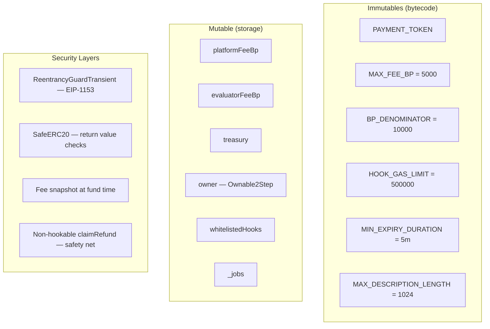
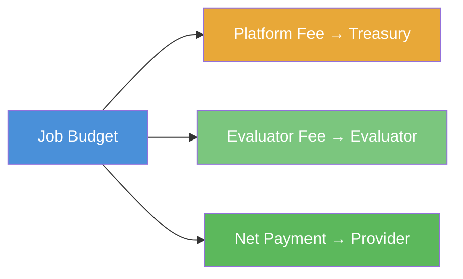
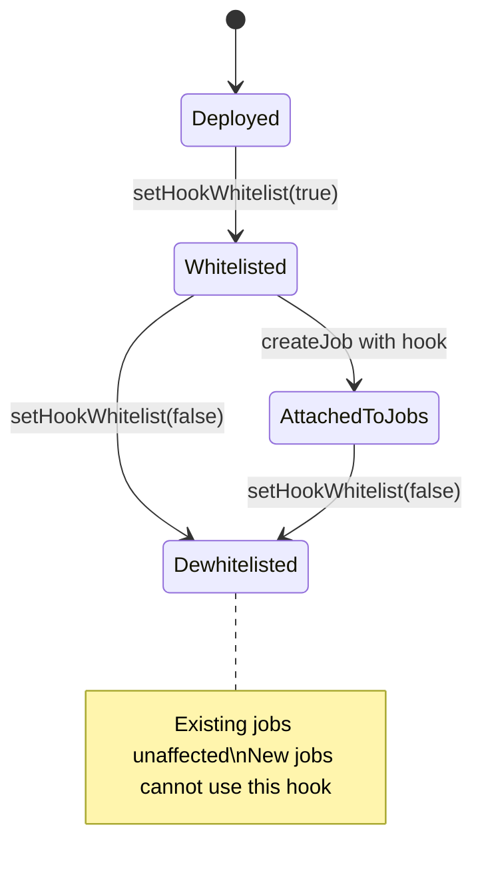

# Operations & Maintenance Guide

Post-deployment administration, monitoring, and incident response for AgenticCommerce (ERC-8183).

## Architecture Overview



### Key Design Properties

- **Non-upgradeable** — no proxy, no `SELFDESTRUCT`. Deployed bytecode is permanent.
- **Single token** — one `PAYMENT_TOKEN` per deployment. Multi-token requires multiple deployments.
- **Fee snapshot** — `fund()` captures `platformFeeBp`, `evaluatorFeeBp`, and `treasury` into the job. Admin fee changes never affect already-funded jobs.
- **Disabled renounceOwnership** — calling `renounceOwnership()` always reverts. Admin access cannot be accidentally lost.

---

## Role & Permission Model

### Contract-Level Roles

| Role | Address | Capabilities |
| ---- | ------- | ------------ |
| **Owner** | `owner()` | Fee management, treasury, hook whitelist, ownership transfer |
| **Pending Owner** | `pendingOwner()` | Can accept ownership transfer |

### Per-Job Roles

| Role | Set By | Capabilities |
| ---- | ------ | ------------ |
| **Client** | `msg.sender` of `createJob()` | `setProvider`, `setBudget`, `fund`, `reject` (Open only) |
| **Provider** | Client via `createJob` or `setProvider` | `setBudget`, `submit` |
| **Evaluator** | Client via `createJob` (immutable per job) | `complete`, `reject` (Funded/Submitted) |
| **Anyone** | — | `claimRefund` (after expiry), `getJob`, view functions |

### Permission Matrix

| Function | Owner | Client | Provider | Evaluator | Anyone |
| -------- | ----- | ------ | -------- | --------- | ------ |
| `createJob` | | ✅ (becomes client) | | | |
| `setProvider` | | ✅ | | | |
| `setBudget` | | ✅ | ✅ | | |
| `fund` | | ✅ | | | |
| `submit` | | | ✅ | | |
| `complete` | | | | ✅ | |
| `reject` (Open) | | ✅ | | | |
| `reject` (Funded/Submitted) | | | | ✅ | |
| `claimRefund` | | | | | ✅ (after expiry) |
| `setPlatformFee` | ✅ | | | | |
| `setEvaluatorFee` | ✅ | | | | |
| `setTreasury` | ✅ | | | | |
| `setHookWhitelist` | ✅ | | | | |
| `transferOwnership` | ✅ | | | | |

---

## Admin Operations

### Fee Adjustment

```bash
# View current fees
cast call $AC "platformFeeBp()(uint256)" --rpc-url $RPC
cast call $AC "evaluatorFeeBp()(uint256)" --rpc-url $RPC

# Update platform fee (owner only)
cast send $AC "setPlatformFee(uint256)" 300 --rpc-url $RPC --private-key $KEY

# Update evaluator fee (owner only)
cast send $AC "setEvaluatorFee(uint256)" 150 --rpc-url $RPC --private-key $KEY
```

**Constraints:**

- `platformFeeBp + evaluatorFeeBp ≤ 5000` (MAX_FEE_BP)
- Changes only affect future `fund()` calls
- Already-funded jobs are immune (fee snapshot)

### Treasury Management

```bash
# View current treasury
cast call $AC "treasury()(address)" --rpc-url $RPC

# Update treasury (owner only)
cast send $AC "setTreasury(address)" $NEW_TREASURY --rpc-url $RPC --private-key $KEY
```

**Best practice:** Use a multisig (e.g., Gnosis Safe) as treasury. If rotating, funded jobs still pay the old treasury (snapshot).

### Ownership Transfer (Two-Step)

```bash
# Step 1: Current owner initiates transfer
cast send $AC "transferOwnership(address)" $NEW_OWNER --rpc-url $RPC --private-key $OLD_KEY

# Verify pending owner
cast call $AC "pendingOwner()(address)" --rpc-url $RPC

# Step 2: New owner accepts
cast send $AC "acceptOwnership()" --rpc-url $RPC --private-key $NEW_KEY

# Verify
cast call $AC "owner()(address)" --rpc-url $RPC
```

**Two-step transfer** prevents accidental transfer to a wrong or inaccessible address. The pending owner must actively call `acceptOwnership()`.

### Hook Whitelist Management

```bash
# Add hook to whitelist
cast send $AC "setHookWhitelist(address,bool)" $HOOK true --rpc-url $RPC --private-key $KEY

# Remove hook from whitelist
cast send $AC "setHookWhitelist(address,bool)" $HOOK false --rpc-url $RPC --private-key $KEY

# Check hook status
cast call $AC "whitelistedHooks(address)(bool)" $HOOK --rpc-url $RPC
```

**Warning:** Removing a hook from the whitelist does **not** affect jobs already created with that hook. Those jobs continue to call the hook normally. The whitelist only blocks new `createJob()` calls.

---

## Monitoring & Alerting

### Critical Events to Monitor

| Event | Significance | Action |
| ----- | ------------ | ------ |
| `HookWhitelistUpdated` | Hook trust changed | Verify if authorized |
| `PlatformFeeUpdated` | Revenue model changed | Confirm intentional |
| `EvaluatorFeeUpdated` | Fee structure changed | Confirm intentional |
| `TreasuryUpdated` | Fee recipient changed | Verify new address |
| `OwnershipTransferStarted` | Admin change initiated | Verify new owner |
| `OwnershipTransferred` | Admin change completed | Confirm expected |

### Job Lifecycle Events

| Event | Monitor For |
| ----- | ----------- |
| `JobCreated` | New job volume, spam detection |
| `JobFunded` | Escrow inflow, large amounts |
| `JobSubmitted` | Provider activity |
| `JobCompleted` + `PaymentReleased` | Successful completions, payout amounts |
| `JobRejected` + `Refunded` | Rejection rates, potential disputes |
| `JobExpired` + `Refunded` | Expiry rates, abandoned jobs |
| `EvaluatorFeePaid` | Evaluator revenue tracking |

### Event Filtering with Cast

```bash
# Monitor all job creations
cast logs --from-block latest --address $AC \
  "JobCreated(uint256,address,address,address,uint256,address)" \
  --rpc-url $RPC

# Monitor large fundings (need indexer for amount filtering)
cast logs --from-block latest --address $AC \
  "JobFunded(uint256,address,uint256)" \
  --rpc-url $RPC
```

### Recommended Indexing Stack

| Tool | Purpose |
| ---- | ------- |
| **The Graph** | Subgraph for job state indexing and GraphQL API |
| **Ponder** | TypeScript-native indexer for real-time event processing |
| **OpenZeppelin Defender** | Automated monitoring, alerting, and admin operations |
| **Tenderly** | Transaction simulation, alerting, and debugging |

### Example Subgraph Schema

```graphql
type Job @entity {
  id: ID!
  client: Bytes!
  provider: Bytes
  evaluator: Bytes!
  budget: BigInt!
  status: JobStatus!
  hook: Bytes
  createdAt: BigInt!
  fundedAt: BigInt
  completedAt: BigInt
  expiredAt: BigInt!
}

enum JobStatus {
  Open
  Funded
  Submitted
  Completed
  Rejected
  Expired
}
```

### Health Check Queries

```bash
# Total jobs created
cast call $AC "jobCounter()(uint256)" --rpc-url $RPC

# Contract token balance (should equal sum of all funded-but-not-settled jobs)
cast call $TOKEN "balanceOf(address)(uint256)" $AC --rpc-url $RPC

# Verify contract is operational (ERC-165 check)
cast call $AC "supportsInterface(bytes4)(bool)" "0x01ffc9a7" --rpc-url $RPC
```

### Balance Reconciliation

The contract balance should always equal the sum of budgets for all jobs in `Funded` or `Submitted` status. Any discrepancy indicates:

1. **Surplus** — someone sent tokens directly (non-recoverable without migration)
2. **Deficit** — critical bug or exploit (should not happen with SafeERC20)

```bash
# Quick check
BALANCE=$(cast call $TOKEN "balanceOf(address)(uint256)" $AC --rpc-url $RPC)
echo "Contract holds: $BALANCE tokens"
```

---

## Incident Response

### Severity Classification

| Level | Description | Examples | Response Time |
| ----- | ----------- | -------- | ------------- |
| **P0 Critical** | Active fund loss or exploit | Reentrancy exploit, token drain | Immediate |
| **P1 High** | Functional breakage | Hook DoS, stuck jobs | < 1 hour |
| **P2 Medium** | Degraded service | High gas costs, minor UI issues | < 24 hours |
| **P3 Low** | Non-urgent | Documentation gaps, test coverage | Next sprint |

### P0: Active Exploit

**The contract is non-upgradeable and has no pause mechanism.** Incident response is limited to:

1. **Monitor** — identify affected jobs and amounts
2. **Communicate** — alert users to stop creating/funding new jobs
3. **Whitelist** — remove malicious hooks: `setHookWhitelist(hook, false)`
4. **Migrate** — deploy a fixed version and guide users to the new contract
5. **Expired jobs** — `claimRefund` is always available after expiry (non-hookable)

### P1: Malicious Hook Blocking Operations

If a whitelisted hook starts reverting to block `submit`/`complete`/`reject`:

1. The hook **cannot** block `claimRefund` (deliberately non-hookable)
2. Users wait for `expiredAt` and call `claimRefund` to recover funds
3. Owner removes hook from whitelist to prevent new jobs using it
4. Affected jobs in `Funded`/`Submitted` will naturally expire

```bash
# Remove malicious hook
cast send $AC "setHookWhitelist(address,bool)" $MALICIOUS_HOOK false \
  --rpc-url $RPC --private-key $KEY
```

### P1: Compromised Owner Key

1. **If pending transfer exists** — the attacker can accept. Rotate immediately.
2. **If no pending transfer** — attacker cannot change owner instantly (Ownable2Step protection).
3. **Actions the attacker can take** — change fees (up to 50%), change treasury, modify hook whitelist.
4. **Actions the attacker cannot take** — steal escrowed funds, modify job states, access funded job budgets.

**Mitigation:** Use a multisig as owner. Set up monitoring alerts on `OwnershipTransferStarted`.

### P2: Fee-on-Transfer Token Discovered

If `PAYMENT_TOKEN` is discovered to be a fee-on-transfer token:

1. Jobs will have accounting mismatches (less tokens than `budget`)
2. `complete()` and `reject()` transfers may fail if balance is insufficient
3. **Solution:** Deploy new contract with a standard ERC-20 token, migrate users

---

## Upgrade & Migration Strategy

### Why No Upgradeability?

This contract is intentionally **non-upgradeable**:

- Simpler security model (no proxy storage collisions)
- No admin rug risk via malicious upgrade
- Immutable guarantees for users

### Migration to New Version

When a new version is needed:

1. **Deploy** new contract with updated code
2. **Freeze** old contract — stop whitelisting new hooks, announce deprecation
3. **Drain** — wait for active jobs to complete/expire/reject
4. **Verify** old contract balance reaches 0
5. **Redirect** front-end and SDK to new contract address

### Data Migration

Job data is on-chain and queryable forever. No data migration needed — just point indexers to both old and new contracts.

---

## Fee Management

### Fee Calculation Formula

On `complete()`, fees are calculated from the **snapshot** taken at `fund()` time:

```text
platformFee  = budget × fundedFeeBp ÷ 10000
evaluatorFee = budget × fundedEvalFeeBp ÷ 10000
providerNet  = budget - platformFee - evaluatorFee
```

### Fee Distribution Flow



### Fee Examples

| Budget | Platform (2.5%) | Evaluator (1%) | Provider Net |
| ------ | --------------- | -------------- | ------------ |
| 1,000 USDC | 25 USDC | 10 USDC | 965 USDC |
| 10,000 USDC | 250 USDC | 100 USDC | 9,650 USDC |
| 1 USDC | 0 USDC (rounds down) | 0 USDC | 1 USDC |

### Rounding Behavior

Integer division rounds **down** (Solidity default). Small budgets may yield 0 fees:

```text
budget = 99, feeBp = 100 (1%)
fee = 99 × 100 ÷ 10000 = 0 (rounds down)
```

This benefits the provider. At `MAX_FEE_BP = 5000` (50%), provider always receives ≥ 50% of budget.

### Refund Scenarios

On `reject()` (Funded/Submitted) or `claimRefund()` (expired): **full budget** returned to client, no fees deducted.

---

## Hook Lifecycle

### Hook States



### Whitelisting Requirements

A hook must pass two checks before `createJob()` accepts it:

1. `whitelistedHooks[hook] == true` — admin whitelist
2. `ERC165Checker.supportsInterface(hook, type(IACPHook).interfaceId)` — interface validation

### Hook Audit Checklist

Before whitelisting a hook:

- [ ] Source code verified on block explorer
- [ ] No external calls to untrusted contracts
- [ ] No state modifications to AgenticCommerce storage
- [ ] Gas consumption within 500k limit per call
- [ ] No `selfdestruct` or `delegatecall`
- [ ] `beforeAction` cannot be used to front-run users
- [ ] `afterAction` reverts are intentional (rolls back entire tx)
- [ ] Handles all 6 selector types gracefully
- [ ] `supportsInterface` returns `true` for `IACPHook`

---

## Operational Runbooks

### Runbook: Health Check

**When:** Periodic health check or after suspicious activity.

```bash
#!/bin/bash
# health-check.sh — usage: ./health-check.sh <AC_ADDRESS> <TOKEN_ADDRESS> <RPC_URL>

AC=$1
TOKEN=$2
RPC=$3

echo "=== AgenticCommerce Health Check ==="
echo "Owner: $(cast call $AC 'owner()(address)' --rpc-url $RPC)"
echo "Treasury: $(cast call $AC 'treasury()(address)' --rpc-url $RPC)"
echo "Platform Fee: $(cast call $AC 'platformFeeBp()(uint256)' --rpc-url $RPC) bp"
echo "Evaluator Fee: $(cast call $AC 'evaluatorFeeBp()(uint256)' --rpc-url $RPC) bp"
echo "Total Jobs: $(cast call $AC 'jobCounter()(uint256)' --rpc-url $RPC)"
echo "Contract Balance: $(cast call $TOKEN 'balanceOf(address)(uint256)' $AC --rpc-url $RPC)"
echo "ERC-165 OK: $(cast call $AC 'supportsInterface(bytes4)(bool)' '0x01ffc9a7' --rpc-url $RPC)"
```

### Runbook: Emergency Hook De-whitelist

**When:** Hook is behaving maliciously or has a discovered vulnerability.

```bash
# 1. Remove from whitelist immediately
cast send $AC "setHookWhitelist(address,bool)" $HOOK false \
  --rpc-url $RPC --private-key $KEY

# 2. Verify removal
cast call $AC "whitelistedHooks(address)(bool)" $HOOK --rpc-url $RPC

# 3. Assess impact:
#    - New jobs cannot use this hook
#    - Existing jobs with this hook continue calling it
#    - If hook is DoS-ing, users wait for expiry → claimRefund
```
